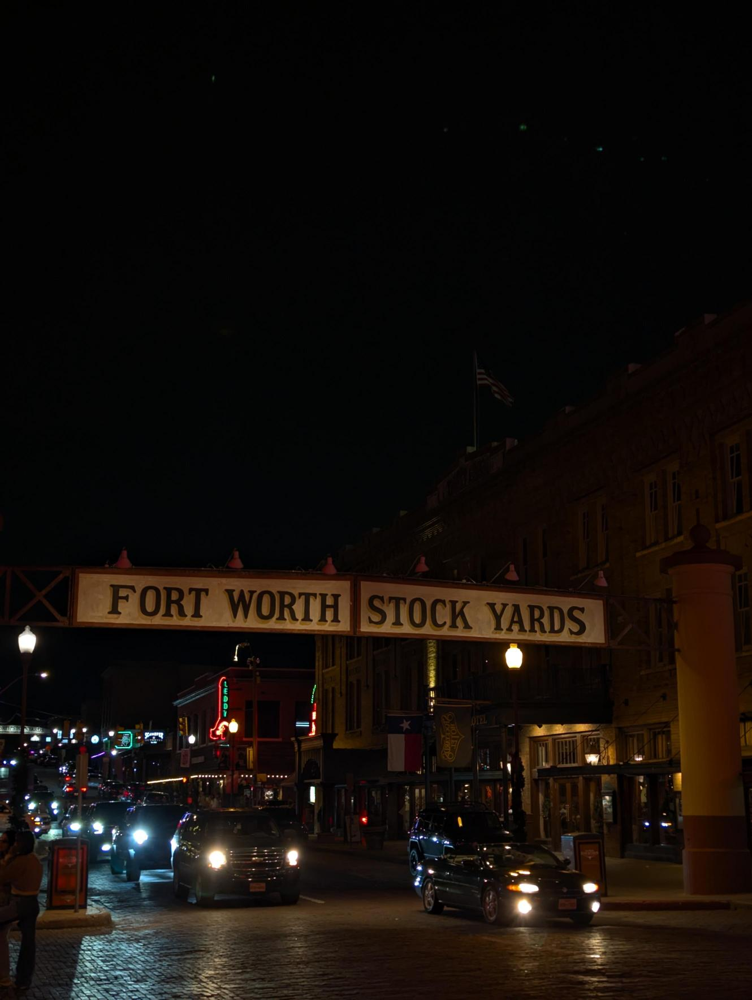

## Hi there 👋

## My name is **Alex** :)

### I'm currently a Junior system administrator.
I've been fortunate to get hands on experience with:
* RHEL, Ubunut, SUSE systems
* Windows administration
* Fortigate firewalls
* Virtualization platform such as:
  - VMWare
  - Hyper-V
  - KVM
* Network set-up and troubleshooting from _Layer 1_ through _Layer 7_
* Azure adminstration with an emphasis on:
  - AVD(_Azure Virtual Desktop_)
  - *Entra ID*
  - SSO for enterprise applications
 
### I'm currently going through the *Learn to Cloud* guide to gain foundational knowledge in:
 1. Linux (**NOTE**: I went through Sander van Vught's _Red Hat RHCSA 9 (EX200)_ book)
 2. Python
 3. Network (**NOTE**: I Went through a full CCNA course from Jeremy's IT Lab and completed a lab that encompasses the course)
 4. Cloud (**NOTE**: My approach is to learn by doing so I will tackle on the _Cloud Resume Challenge_ early 2026)
 5. DevOps
    - K8
    - CI/CD
    - Containers (I've ran a few podman containers in RHEL but will focus on Docker)
    - IaC (Terraform specifically, I've done a bit of Terraform when deploying new AVD sessions) 
 6. Cloud Security

[x] Phase 0: Starting from zero
[ ] Phase 1: Git, Linux, and Bash
[ ] Phase 2: Programming
[ ] Phase 3: Cloud fundamentals

## Here are some cool picture's i've taken over the years with context, **enjoy**!
Picture|Context
-|-
 | FW stockyards
<!--
**leonisT2/leonisT2** is a ✨ _special_ ✨ repository because its `README.md` (this file) appears on your GitHub profile.

Here are some ideas to get you started:

- 🔭 I’m currently working on ...
- 🌱 I’m currently learning ...
- 👯 I’m looking to collaborate on ...
- 🤔 I’m looking for help with ...
- 💬 Ask me about ...
- 📫 How to reach me: ...
- 😄 Pronouns: ...
- ⚡ Fun fact: ...
-->

